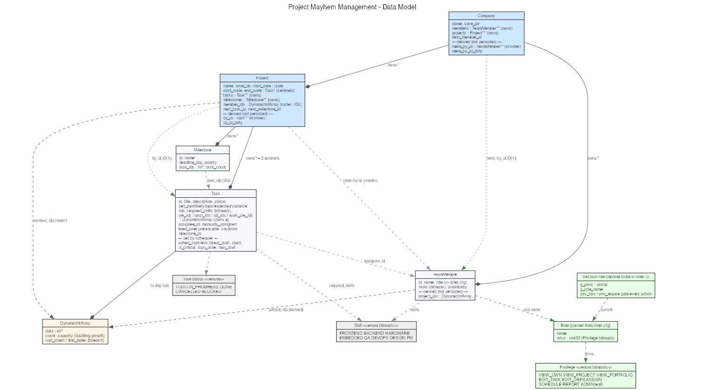
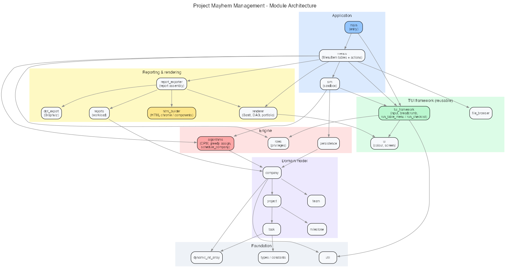
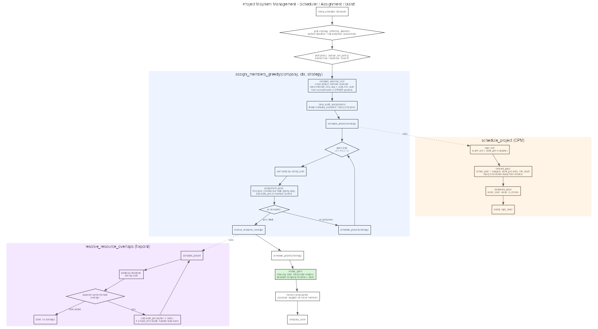

# Project Mayhem Management
### A project-portfolio scheduling engine in pure C99

**Final Project — Introduction to Computer Science**
HIT, Spring 2026

<!--
Speaker note: console app, no dependencies, a real scheduling kernel —
not a to-do list. 10 minutes + 5 for questions.
-->

---

## What it is

A **console portfolio planner** in pure C99. It models a software company as:

- **Projects** — each a graph (DAG) of **tasks** with dependencies
- **Tasks** — three-point **PERT** estimates + a risk weight
- **Team members** — a shared pool, staffed across projects

From that model it computes a real **schedule**: critical path, earliest
start/finish, slack — then assigns people, resolves conflicts, and renders
Gantt charts, dependency graphs, and HTML reports.

> A genuine **scheduling engine**: it computes real critical-path schedules and
> resolves resource conflicts — the core of a tool like MS Project, delivered as
> a fast, dependency-free terminal app.

---

## Who it is for

| Role | What they see |
|------|---------------|
| **Project Manager** | Build the task DAG, estimate, assign, schedule, export |
| **Executive** | Read-only portfolio: company Gantt, workload, exec report |
| **Team Member** | Only their own assigned tasks + schedule |
| **Admin** | Everything, plus team management |

At sign-in you pick a role from `roles.cfg`, and every action is gated by a
**privilege bitmask** (view / edit / assign / schedule / report / admin).

---

## Originality — a real scheduling kernel

The standout is **depth in the scheduling core**, where tools like Jira, Asana
and MS Project stay shallow:

- a true **CPM Gantt** — every bar comes from a real forward/backward pass, not
  a hand-drawn timeline
- a **dependency engine** with automatic **cycle rejection**
- a **cross-project member calendar** that catches resource clashes **at
  schedule time**

Delivered as an intentionally **minimal, zero-dependency terminal app**: fast to
run, easy to explain, and every result traceable to the algorithm that produced
it.

**Focused by design** — one correct, explainable kernel, built to be defended
line by line.

---

## User experience

A clean, colored terminal UI:

- **Breadcrumb navigation** — always know where you are
- A **generic menu runner** (`run_menu`) with consistent input validation
- **Status feedback** after every action; zebra-striped tables
- ASCII-only output for portability

```
Project Mayhem Management   [role: Project Manager]
 > Company > Apollo > Schedule
 1. Generate schedule    4. Dependency graph
 2. Report               5. Export .dot
 3. Gantt chart          6. Export HTML report
```

---

## Data structures (the `struct`s)

| Struct | Role |
|--------|------|
| `Company` | Owns `members` + `projects` (arrays of struct pointers) |
| `Project` | Owns `tasks` + `milestones`; `member_ids` roster |
| `Task` | PERT, risk, skills bitmask; **4** dependency lists |
| `TeamMember` | Skills bitmask, availability, role |
| `Milestone` | Deadline day, priority, attached task-id list |
| `DynamicIntArray` | **Reusable growable `int` array** — the building block |
| `Date` | year / month / day for the schedule timeline |

Ids are **per-project**, not global — looked up via `project_find_task(id)`.

---

## Data model



---

## Module architecture



---

## Generic vs. app-specific

A deliberate split: reusable infrastructure knows **nothing** about projects.

| Generic (reusable) | App-specific (the domain) |
|--------------------|---------------------------|
| `dynamic_int_array` — growable `int` vector | `task` · `project` · `company` |
| `tui_framework` — menu engine, input | `algorithms` — CPM, PERT |
| `html_builder` — HTML primitives | `renderer` · `report_exporter` |
| `ui` · `file_browser` | `persistence` · `roles` · `sim` |

**How C does it:** `run_table_menu(void *ctx, render, …)` takes a `void *ctx` +
**function pointers** — it drives any screen without knowing the data behind it.

> C++ would use templates + `std::function`; in C it's `void*` + function
> pointers — type erasure by hand. Write it once, reuse everywhere.

---

## Arrays & dynamic memory — *three deliberate kinds*

**1. `DynamicIntArray` — a growable-array *object*** (`data`/`count`/`capacity`
+ `dia_*` ops). Written once, reused **by value** for every list of ids
(`Task.{pre,post,alt,work_pre}_ids`, `Project.member_ids`, …).

**2. Hand-rolled `T** + count + capacity`** — for arrays of *owned struct
pointers* (not ints, so not a `DynamicIntArray`): `Company.members / projects`,
`Project.tasks / milestones`. `realloc` doubling; freed in `*_destroy`.

**3. Fixed-size buffers** where the bound is known — `char name[]`, `title[]`.
No heap, no waste.

Plus derived **`id → pointer` index tables** rebuilt on load → **O(1)** lookup on
the read-heavy scheduling paths.

> **Why:** size is unknown at compile time and the scheduler walks the graph
> constantly. Every `malloc` has a matching `free` — ownership is explicit.

---

## Files — persistence & reports

**Save format — a directory bundle** (human-readable text):

```
company/
  company.yaml         <- company metadata
  team.yaml            <- all members
  projects/<name>/project.yaml   <- tasks, deps, schedule
```

- `company_save` / `company_load` walk the bundle with `fopen`/`fprintf`/`fgets`
- **HTML report export** — a self-contained styled report written to disk
- **Graphviz `.dot` export** — the dependency graph, rendered to SVG

File handling is used for **real persistence and output**, not a toy read/write.

---

## Key functions (a selection)

| Function | Parameters | Role |
|----------|-----------|------|
| `topo_sort` | `Project*, int out[]` | Kahn topological order of the DAG |
| `forward_pass` | `Project*, strategy` | Earliest start/finish (CPM) |
| `backward_pass` | `Project*` | Latest start/finish + **slack** |
| `assign_members_greedy` | `Company*, idx, strategy` | Skill-matched staffing |
| `resolve_resource_overlaps` | `Project*` | Serialize a member's clashes |
| `project_link_tasks` | `Project*, from, to` | Add edge + **cycle rejection** |
| `company_load` | `const char* dir` | Rebuild company from bundle |
| `main` | — | Sign-in → company → menu loop |

---

## The central algorithm — Critical Path Method

```
1. topo_sort        Kahn's algorithm — linear order of the task DAG
2. forward_pass     ES/EF per task, in topo order  (earliest)
3. backward_pass    LS/LF per task, reverse order   (latest)
4. slack = LS - ES  tasks with slack 0 = CRITICAL PATH
5. assign_members   greedy, skill-matched, 3 strategies
6. resolve overlaps fixpoint until no member double-booked
```

- **PERT** per task: `expected = (min + 4·likely + max) / 6`
- **3 strategies**: earliest-deadline · risk-weighted · pessimistic worst-case

The Gantt chart is a **view** of these computed fields, drawn on an absolute
company timeline.

---

## Scheduler pipeline



---

## Challenge & reflection (1/2)

**The hardest problem: a member working on two projects at once.**

The first scheduler planned each project **in isolation** — so a member booked
on Project A from day 0 was *also* treated as free from day 0 on Project B.
**Silent double-booking**, invisible on either project's Gantt.

**Fix — a cross-project floor.** `compute_external_floor` places every project
on one **absolute timeline** (`date_to_days`), finds each member's latest
commitment elsewhere, and seeds a per-task `min_start` floor that the forward
pass cannot violate. A shared member is now serialized across projects.

---

## Challenge & reflection (2/2)

**A second subtlety: resolving one overlap *creates* another.**

When you push task T to clear a clash, T can land on top of the member's *next*
task. A single cleanup pass isn't enough.

**Fix — a fixpoint.** `resolve_resource_overlaps` reschedules, groups a member's
tasks by start time, links each overlap earlier→later, and **repeats until a
pass adds zero edges**. Edges always point forward in time ⇒ the graph stays
acyclic ⇒ it provably converges.

> Lesson: resource leveling is iterative, not one-shot. Catching this gap (and
> the cross-project one) was the core engineering insight of the project.

---

## Using AI without losing ownership

The tension: the same tool that saves hours can shortcut the **understanding**.

- **AI does labour and critique** — it writes the mechanical and reviews it; the
  *decisions* (data structures, algorithms, modules) stay mine.
- **Keep nothing I can't explain** — unclear code → flip AI to Socratic mode and
  have it *quiz* me until I can defend it.
- **Interesting parts by hand** — pointers, memory, the graph, CPM I worked
  through myself; the boilerplate around them I delegate.
- **Verification is mine** — generated code is a draft until it builds `/W4`
  clean and a test proves it.

> AI multiplies output, but **ownership and understanding have to be actively
> defended.**

---

## How AI was used

Built with **Claude / Claude Code** (Opus 4.x; Sonnet for delegated sub-tasks).
Full breakdown in `AI_USAGE.md`.

| Phase | AI usage examples |
|-------|-------------------|
| **Ideation** | Compare vs. real PM tools, find the original angle |
| **Alternatives** | Lay out trade-offs (composite vs. leaf, index vs. `bsearch`) — I decide |
| **Heavy labour** | Restructure menus → generic TUI; write the YAML / HTML parsers |
| **Implementation** | Draft modules from a precise spec I wrote |
| **Guided learning** | I wrote Kahn's topo sort; AI suggested optimizations + helped debug |
| **Knowledge expansion** | When I don't know *how*, I ask for guidance |
| **Code review** | Second pair of eyes — incl. one agent checking another's output |
| **Build & test** | MSVC `/W4` build validation + unit-test harnesses |
| **Learning** | Socratic — AI quizzes me, I push back; each defends, best idea wins |
| **Docs** | Diagrams, doc comments, and **this presentation** |

---

## Gaps remaining / roadmap

Designed to grow along one coherent arc:

- **Company-scale unified scheduler** — plan all projects as one combined model
  on a shared timeline (turns *coarse* cross-project awareness into *exact*)
- **Auto-split around vacations** — true preemption: a task splits around a
  worker's vacation and resumes after
- **Subcontractor / temp worker** — an external hire bound to one task (a hook
  for future cost tracking)

(Recorded as design intent in `EXTRAPOLATION.md`.)

---

## Technical envelope

- **Language:** standard **C99**, built with MSVC, `/W4`, **0 warnings**
- **Dependencies:** none to build/run (Graphviz optional, for graph images)
- **Footprint:** ~20 translation units, fully dynamic memory, hand-rolled
  growable arrays, `id→pointer` index for O(1) lookup
- **Split:** logical `.c`/`.h` modules — types, data structures, algorithms,
  rendering, persistence, UI
