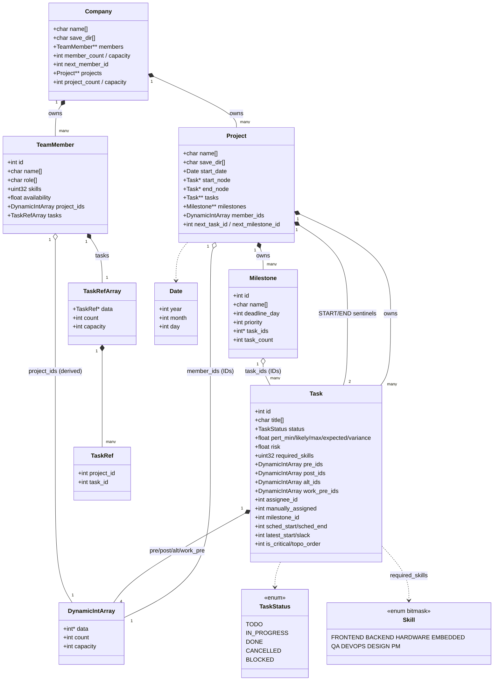
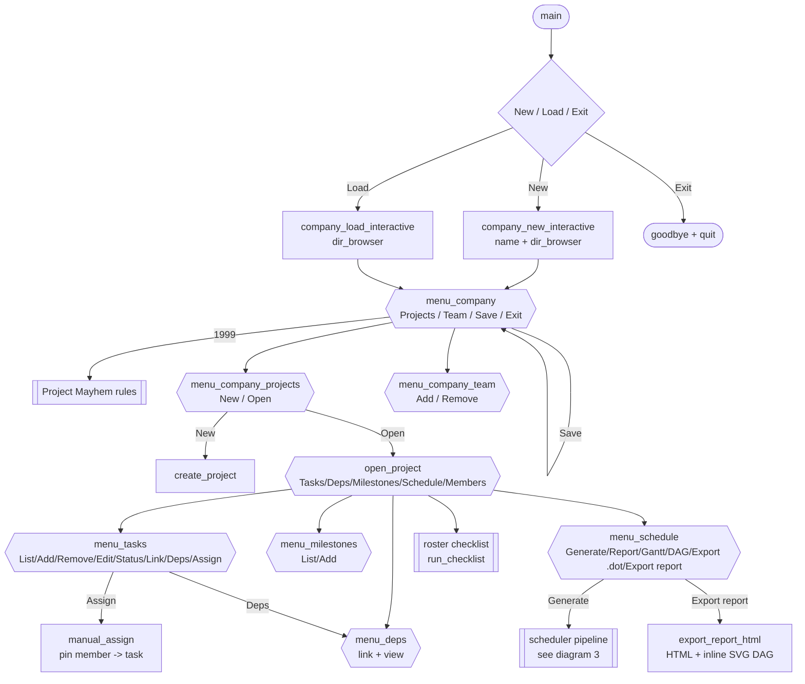
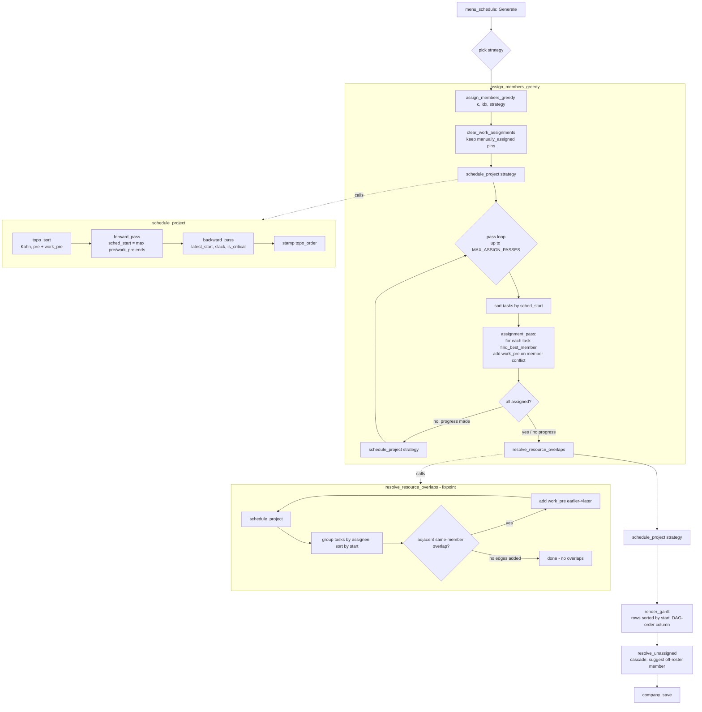

# Project Mayhem Management - Diagrams

All three diagrams are **Mermaid**. To use in draw.io:
**+ (Insert) -> Advanced -> Mermaid...**, paste a block.
(Or render/tweak at https://mermaid.live and export SVG/PNG.)

---

## 1. Data-structure UML (class diagram)

`*--` = owns (composition, frees on destroy);  `o--` = references (no ownership).

---

## 2. GUI flow chart

---

## 3. Scheduler / assignment / Gantt pipeline

