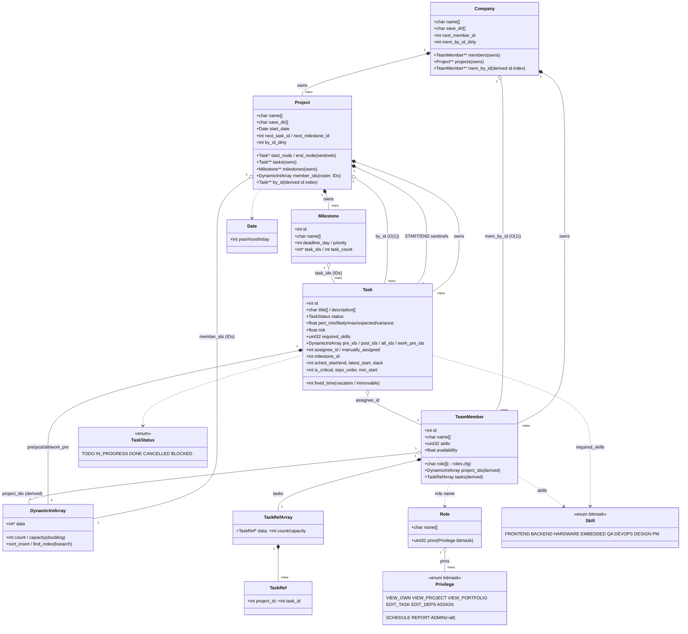
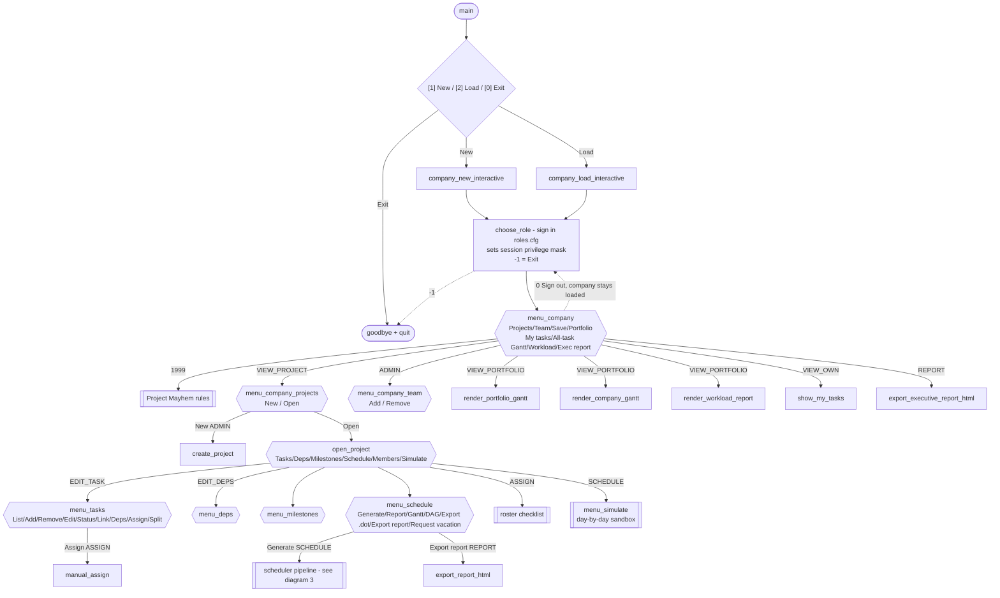
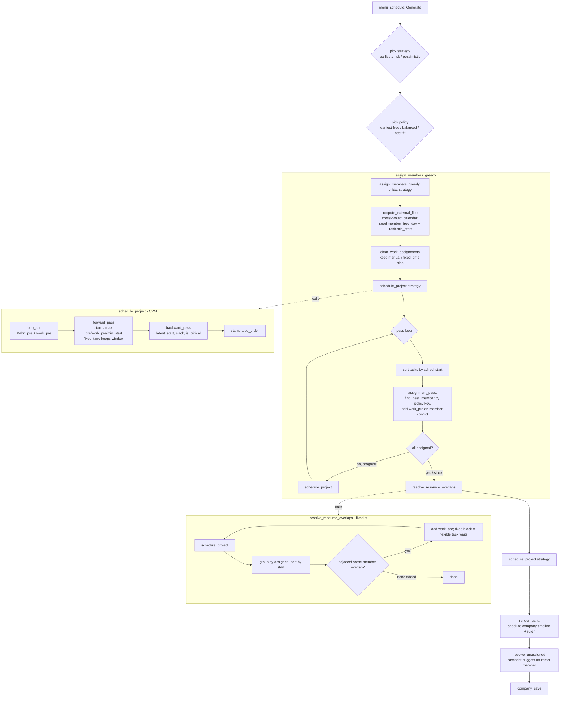
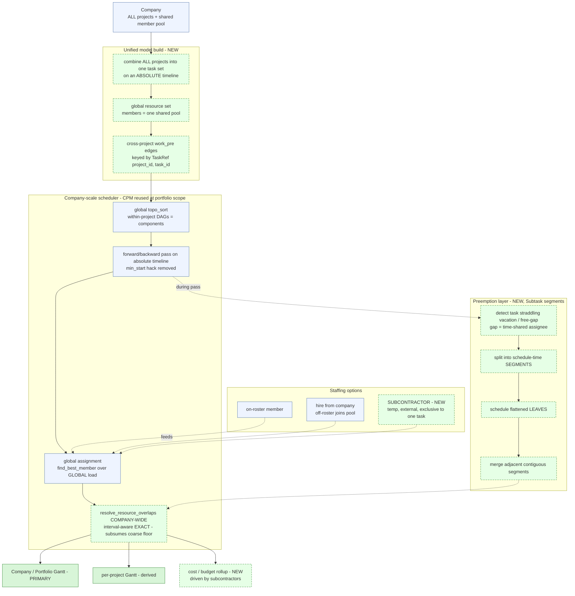

# Project Mayhem Management - Diagrams

All three diagrams are **Mermaid**. To use in draw.io:
**+ (Insert) -> Advanced -> Mermaid...**, paste a block.
(Or render/tweak at https://mermaid.live and export SVG/PNG.)
The matching Graphviz sources + rendered SVG/PNG live in `diagrams/` (`dot -Tsvg/-Tpng`).

---

## 1. Data-structure UML (class diagram)

`*--` = owns (composition, frees on destroy);  `o--` = references / derived (no ownership).

---

## 2. GUI flow chart (privilege-gated)

Startup picks the **company first**, then signs in as a **role**; "Sign out" returns to
role sign-in with the company still loaded. Every action is gated by `priv_require`.

---

## 3. Scheduler / assignment / Gantt pipeline

---

## 4. Future-state architecture (PLANNED - not yet built)

The next architectural arc: a **company-scale unified scheduler** (all projects as one,
exact interval-aware resource awareness), **subcontractors** (temp exclusive workers), and
a **Subtask preemption layer** (auto-split around vacations / free gaps). Green/dashed =
new; blue = existing logic reused at the new (portfolio) scope. See
`ARCHITECTURE_AND_ALGORITHMS.md` §12.

